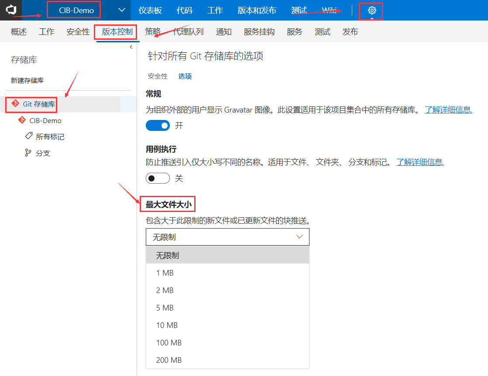
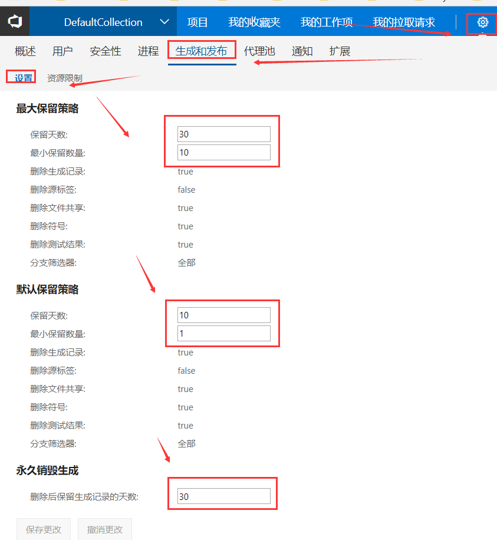
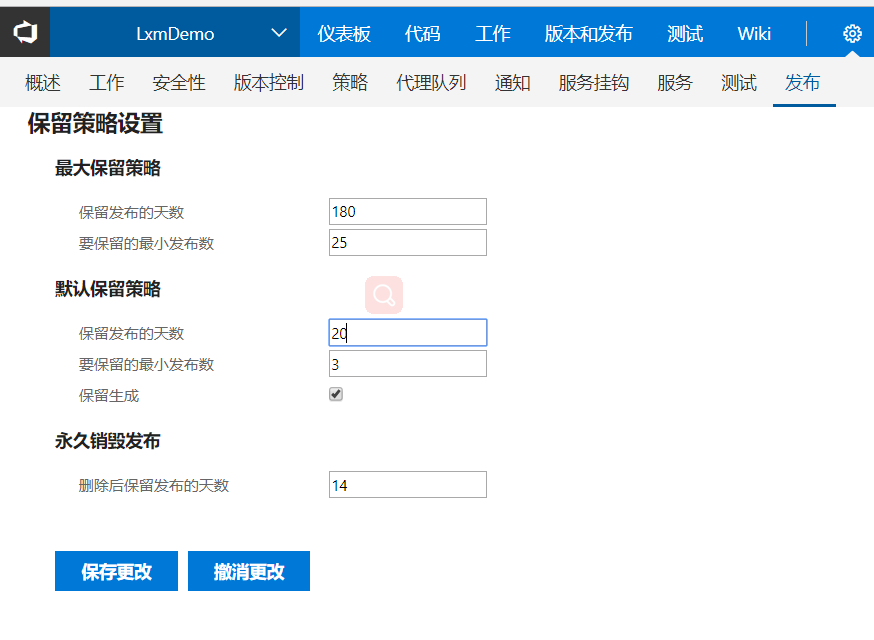
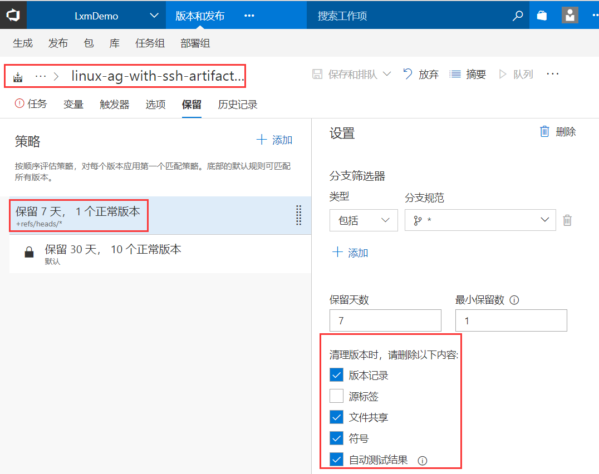
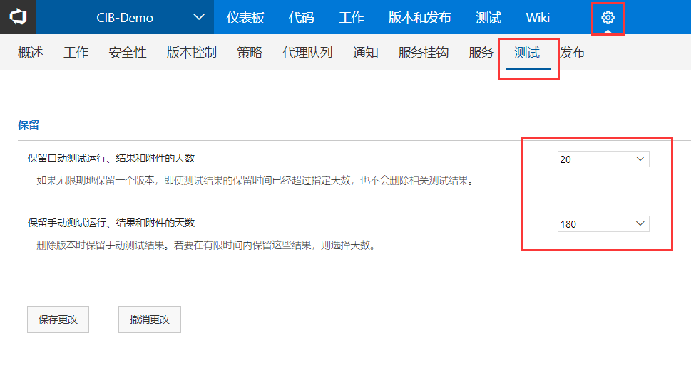
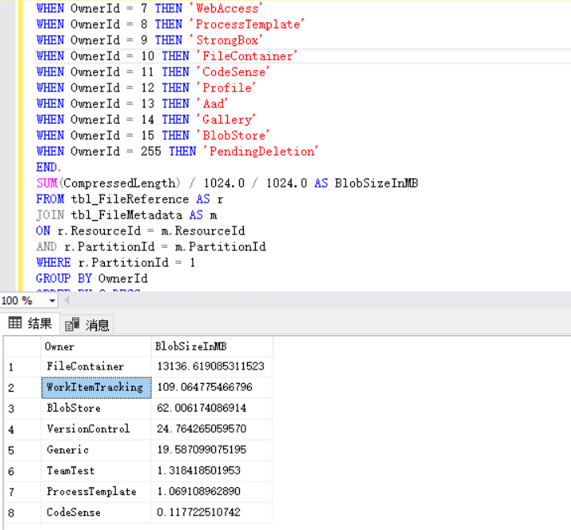
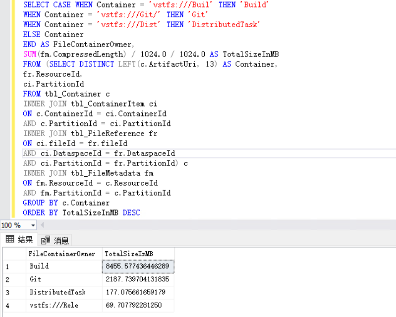

# TFS优化


##  一、背景


在使用TFS的过程中，有时候会发现数据库占用的空间快速增长，对存储成本较敏感的企业可能会比较在意这方面的问题。随着对TFS的使用，用户规模和团队项目规模也会慢慢变大，占用的存储空间也日益变大。  

因此，我们在这里总结了一些技巧和实践，希望借此机会能和大家分享交流，包括 文档、代码、包管理等建议，后面会分享TFS数据存储空间占用情况分析的一些经验。    

## 二、 概述

众所周知，TFS产生的各项数据都是存储在SqlServer 数据库中的。通常较占空间的往往是一些二进制文件，其实文本文件并不会占用太多空间。比较典型的文件有以下几类：

-   1、工作项中的附件，如文档、图片、压缩包等

-   2、文档，如研发过程中的文档

-   3、源代码，比如源码文件

-   4、构建包，比如编译后的Jar包、dll、依赖包等

-   5、测试结果，如测试截图，视频，附件等

接下来本文会重点探讨以上2、3、4、5几类文件的管理。


## 三、 版本库

### 1、 将文档存放至TFS版本库

**TFS中的版本控制**

在TFS中，有两种版本控制系统：TFVC和Git，TFVC是传统的集中式管理方案，Git是分布式管理。Git的方式更适合于现代的企业，对于源码的存放也优先推荐使用Git。


**开发过程中的文档**

对于开发过程中的Office类的文档，建议采用专门的文档版本存储方案，如SharePoint或是其他方案。不具备此条件时，再考虑将文档存放至源码版本库。

**文档格式**

存放至源码版本库时，文档尽量使用文本格式，比如Markdown格式，这样文档修改后保存的是增量，并不会占用太多数据库存储空间。在TFS2017及以上版本，还可以采用内置的Wiki库来存放技术文档。


**TFVC和Git如何选择**

如果确实需要将Office文档存放至TFS，建议优先考虑采用TFVC源码版本库，因为TFVC对于二进制文件有更好的性能。


Git本身对二进制文件并无特别的优化，如果使用Git存储进制文件，可以使用Git LFS来获取更好的性能，但这需要客户端安装Git LFS扩展工具。


这两这种方式都是将文档存至TFS服务器，区别在于：

- TFVC安装Team Explore客户端工具后才能支持更完备的功能（当然也可以通过TFS WebPortal进行简单的文件操作），
- 而GIt需要客户端安装Git LFS扩展。
- 最大的区别当然就是集中式版本控制与分布式版本控制系统在使用上的区别了


建议对存储目录根据实际的情况进行规划，规范文档存放的目录结构。


**以下是对上面几种方案对比：**


1）、   **使用SharePoint Server 2016** :

组织级别的文档管理和存储方案，可在线查看和管理文档,支持跨部门、跨团队的协作和流转。SharePoint包含可定制化组织级门户网站，网站可以包含新闻、社区、事件/活动、文档中心、记录中心（合规性和财务记录文档）、工作流等内容和功能。

如果需要在组织层面引入SharePoint，需要较专业的人员进行咨询和实施，以定制适应企业的解决方案

NOTE： 另外，如果是小团队，可以采用云方案，如Office365，或是其他厂商的云方案


2）、   **使用TFS团队项目内的TFVC版本库**：

适应于团队级别，且限于开发过程中的偏技术类的文档，无法在线查看、编辑。
分享或协作仅限于内部团队。代码与文档存在相同的服务器中，文档量大时对服务器会带来存储压力，也会产生一定的性能问题。

**依赖的工具**： TFS Web Portal或是安装Team Explorer客户端工具来完成文档的管理


3）、   **使用独立的TFS服务器存放文档**：

适用于组织级别和团队级别的文档存放,当文档量较大，在不影源代码服务器的情况下可以把文档服务器独立出来。建议统一规划文档中心结构, 组织形式不必采用按多个TFS团队项目（指源TFS码服务器中的团队项目）的方式来组织,可根据产品、业务、领域划分团队项目，将多个团队的文档存放至同一个团队项目，根据目录结构设置各部门、各团队或是各项目组人员的权限.

**使用的工具：**通过TFS Web Portal或是安装Team Explorer客户端工具来完成文档的管理


4）、   **Git Large File Storage（LFS）**: 

适应于团队级别，建议存放开发过程中的偏技术类的文档，但无法在线查看、编辑。GIt 仓库默认对二进制文件支持不是很好，Git的设计的初衷是用来存放文本文件的，可以使用 Git LFS来获取更好的性能,但这需要客户端安装Git LFS扩展工具. 并配合使用Git lfs track命令来完成提交。

NOTE：当然，如果文档量较少，直接使用git 存储库存放也是可以，同样建议规划好文档目录结构。


5）、   **TFS WIKI :**

适应于团队级别（源码TFS服务器中的）或是组织级别（独立TFS文档服务器中的WIKI），建议存放开发过程中的偏技术类的文档。在TFS Web Portal 具有所见即所得的编辑方式，文档采用 Markdown 格式编写。可添加其他附件，图片使用 CRTL+V 直接粘贴到文档内容中（自动插入图片并上传），省去了手动保存图片并上传烦恼。Wiki同时也是一个Git仓库，可以像代码一样进行离线编辑、版本跟踪,在本地可以使用自己习惯的Markdown编辑文本。


**如果有使用TFS，优先考虑使用 WIKI来保存技术类文档**


**如果无法在组织级引入统一的文档解决方案，可以采用折衷方案:**

-   使用独立的TFS服务器存放流程类、合规类Office文档

-   在独立的TFS服务器中，使用TFS的WIKI存放开发、管理、技术等通用实践，在组织层面共享知识

-   在团队内部使用TFS团队项目中WIKI，存放团队内的技术方面的文档

-   团队内的文档尽量采用WIKI的方式存放，对于其他Office文档如有需要，团队可自行选择采用TFVC还是Git，并规范存储的目录结构


### 2、 源代码


源码通常是文本文件，每次变化保存的是增量，所以源码文件本身不会占用太多的存储空间。占用大量存储空间的通常是一些编译后的中间文件、或是第三方组件包。在迁移代码库至 TFS Git时（或者是对现有的Git仓库）,建议对代码库分析和梳理, 清理不必要的二进制文件。


**对于编译后的中间文件、或是依赖的第三方组件包，可以按以下几种方式进行规划**：

-   存放至统一的代码版本库中，需要时将版本库里面的包获取至本地，再引用至项目中

-   存放至统一的文件服务器，如Windows文件共享、FTP服务器、HTTP文件服务器等。需要至获取至本地，再引用至项目中

-   引入私有的包管理器（或是第三方包管理方案），在企业内部搭建私有的程序包管理仓库，项目中不在直接引用依赖包，而是在需要编译打包或者是运行时再从包管理仓库中自动下载依赖包。

-   使用TFS内置的Package Management, TFS2018 官方已经支持   NuGet、npm、Maven、Gradle 四种包管理源

前面两种方式适用于团队规模较小，项目较少，依赖包复用率不高的场景。后两种是最优实现方式，但实现起来有一些成本，适应于多产品、多项目团队，使用的方案也不是一成一变的，**应该随着团队、产品、公司的成长而改进方案**。


### 3、 TFS Git存储库 单文件大小设置


可以设置Git存储库中单个文件最大的大小，建议设置为100M

 .


## 三、 构建包管理

在TFS的持续集成CI中，构建包的存储方式有两种： `Visual Studio Team Services/TFS Server` 和 `a file share`。

 1） **Visual Studio Team Services/TFS Server**

这种方式简单粗暴，是将构建包直接存放至TFS的后台数据库中。这种方式固然简单，但是**构建包比较大、团队规模较大、构建频率较高时**，数据库将迅速增长**，对于比较在意数据库的存储成本的团队或组织来说，这种存放方式变得不太合适


 2）**a file share**

**Windows构建环境**
 
这种方式是将构建包存放至Windows共享目录中，减少了数据库占用的存储空间。同时这种方式需要额外准备文件存储服务器，且**仅支持Windows构建环境**。如果偿试将Linux agent上执行，会收到以下提示：

```vsts OSX or Linux Agent Artifacts publish to file share 无法将来自 OSX 或 Linux 代理的项目发布到文件共享。可将项目类型更改为服务器或使用 Windows 代理。```

**OSX /Linux 构建环境**

在非Windows的构建环境中，我们需要考虑其他方案，**有两种可选方案**：ftp的方式和SSH的方式，FTP的方式会比较通用，对于Windows的构建环境也支持。SSH的方式针对纯Linux环境，纯Linux的构建环境建议采用这种方式。


**Aftifact Repository**

对于构建包的管理，还可以采用**终极方案**，引入 **Aftifact Repository（即前面所提的包管理器）**，将依赖包和开发中的构建包统一纳入 Aftifact Repository 进行管理，目前市面上有较多的方案（或者采用TFS内置的 Package Management），此处不在一一介绍，基本上所有的方案都可以和TFS CI/CD的流水线进行集成。这种方案大小团队都适用，如果一开始能规划一个可行的方案是最好不过的了。


**TFS 生成和发布的清理策略**

在TFS CI/CD 流水线配置中，可以设置保留的周期和自动清理时清理的内容，如下图：

 .

Figure 1 TFS 生成和发布定期清理策略-集合级别


 .

Figure 2 发布保留策略-团队项目 级别


 .

Figure 3 生成清理内容配置


## 四、 测试相关文件


在执行 手工测试（TestRun）时、触发CICD部署流水线后（测试结果、及代码分析结果）、使用TestManager工具（会产生图片、附件、录屏）、浏览器测试插件Test &Feedback（产生图片、附件、录屏） 等，所产生的数据都存储在数据库中，而且包括大量的二进制文件，会占用比较大的数据库存储空间，通常我们在TFS中可以配置这些数据保留的期限，如下图：


 .


如果经过分析后（参考下面的TFS 数据占用分析），测试部分还是会占用很大一部分空间，可以使用专用的工具Tcmpt 清理。


参考资料：

-   <https://docs.microsoft.com/en-us/vsts/manual-test/getting-started/how-long-to-keep-test-results?view=vsts>

-   <http://blogs.microsoft.co.il/shair/2014/06/29/controlreduce-tfs-db-size/>


## 五、 TFS 数据占用分析

当TFS数据库迅速增长时，TFS的备份文件也会随之而增长，同时会对数据库服务器和TFS备份文件服务器的存储空间会造成影响，如果剩余空间不多，但一时半会没法扩展磁盘容量时，我们需要分析究竟是哪些数据在占用空间。下面我们针对这个问题展开分析，试着找出这些数据，看是否能优化一下存储空间。可以按下面的步骤来分析：


- 1、首先，使用Sql Server Management Studio（SMSS）连接到TFS数据库服务器，执行以下脚本，查看各集合库所占的空间：

```
use master
select DB_NAME(database_id) AS DBName, (size/128) SizeInMB   
 FROM sys.master_files 
 where type=0  and substring(db_name(database_id),1,4)='Tfs_' 
and DB_NAME(database_id)<>'Tfs_Configuration' order by size desc
```

结果如下图所示：

 .


- 2、 使用 SMSS 的报告功能分析集合库中各表所占用的存储空间

 .

 .


如所上图所示，通常是：**tbl_Content** 表占用比较大.


- 4、 分析 tbl_Content 存储的是哪些类型的数据占用空间较大，在集合库中执行下面的脚本：

```
SELECT Owner = 
CASE
WHEN OwnerId = 0 THEN 'Generic' 
WHEN OwnerId = 1 THEN 'VersionControl'
WHEN OwnerId = 2 THEN 'WorkItemTracking'
WHEN OwnerId = 3 THEN 'TeamBuild'
WHEN OwnerId = 4 THEN 'TeamTest'
WHEN OwnerId = 5 THEN 'Servicing'
WHEN OwnerId = 6 THEN 'UnitTest'
WHEN OwnerId = 7 THEN 'WebAccess'
WHEN OwnerId = 8 THEN 'ProcessTemplate'
WHEN OwnerId = 9 THEN 'StrongBox'
WHEN OwnerId = 10 THEN 'FileContainer'
WHEN OwnerId = 11 THEN 'CodeSense'
WHEN OwnerId = 12 THEN 'Profile'
WHEN OwnerId = 13 THEN 'Aad'
WHEN OwnerId = 14 THEN 'Gallery'
WHEN OwnerId = 15 THEN 'BlobStore'
WHEN OwnerId = 255 THEN 'PendingDeletion'
END,
SUM(CompressedLength) / 1024.0 / 1024.0 AS BlobSizeInMB
FROM tbl_FileReference AS r
JOIN tbl_FileMetadata AS m
ON r.ResourceId = m.ResourceId
AND r.PartitionId = m.PartitionId
WHERE r.PartitionId = 1
GROUP BY OwnerId
ORDER BY 2 DESC
```

结果如下图所示：

 .


可以看到 是FileContainer类型的数据占用较大空间


- 5、 分析 tbl_Container 占用的空间

```
SELECT CASE WHEN Container = 'vstfs:///Buil' THEN 'Build'
WHEN Container = 'vstfs:///Git/' THEN 'Git'
WHEN Container = 'vstfs:///Dist' THEN 'DistributedTask'
ELSE Container 
END AS FileContainerOwner,
SUM(fm.CompressedLength) / 1024.0 / 1024.0 AS TotalSizeInMB
FROM (SELECT DISTINCT LEFT(c.ArtifactUri, 13) AS Container,
fr.ResourceId,
ci.PartitionId
FROM tbl_Container c
INNER JOIN tbl_ContainerItem ci
ON c.ContainerId = ci.ContainerId
AND c.PartitionId = ci.PartitionId
INNER JOIN tbl_FileReference fr
ON ci.fileId = fr.fileId
AND ci.DataspaceId = fr.DataspaceId
AND ci.PartitionId = fr.PartitionId) c
INNER JOIN tbl_FileMetadata fm
ON fm.ResourceId = c.ResourceId
AND fm.PartitionId = c.PartitionId
GROUP BY c.Container
ORDER BY TotalSizeInMB DESC
```

结果如下图：

 .


- 6、 最后还可以分析一下近两年数据增长的情况
  
```
select DATEPART(yyyy, CreationDate) as [year],
  DATEPART(mm, CreationDate) as [month],
  count(*) as [count],
  SUM(DATALENGTH(Content)) / 1048576.0 as [Size in Mb],
  (SUM(DATALENGTH(Content)) / 1048576.0) / count(*) as [Average Size]
from tbl_Content
group by DATEPART(yyyy, CreationDate),
    DATEPART(mm, CreationDate)
order by DATEPART(yyyy, CreationDate),
    DATEPART(mm, CreationDate)
```

 .


- 7 、通过上面的分析，我们大致可以确定是哪结数据占用了较大的空间，结合前面的TFS 流水线设置和测试文件保留策略设置，让TFS自动清理这部分数据。


以上分析参考自以下资料：

- https://mattyrowan.com/2014/04/02/need-help-tfs-tbl_content-table-and-database-growth-out-of-control/

- https://naveenalm.wordpress.com/2015/08/04/dar/


##  六、总结

本文围绕TFS的数据库存储优化介绍了文档、构建包等文件的存放建议，同时也介绍了一些TFS中的配置策略。对于构建包，还是强烈建议引入（如果能）采用二进制文件存储仓库（Aftifact Repository），这也是DevOps 中很重要的一项工程实践。

后面提到的  TFS 数据占用分析 ，是在事后进行分析和补救。因此，我们在最开始使用TFS时能注意这些方面最好不过了，特别是在团队规模和项目规模较大时，犹为重要。
